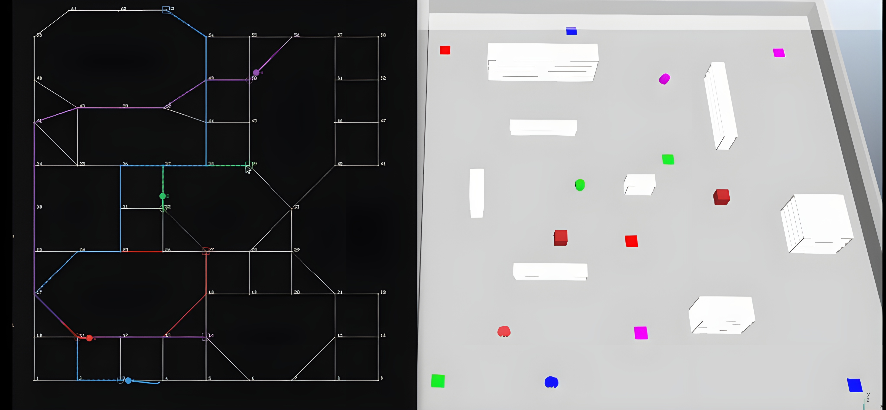
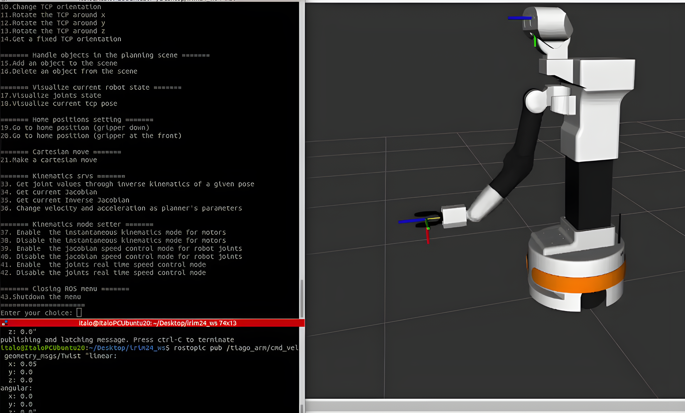
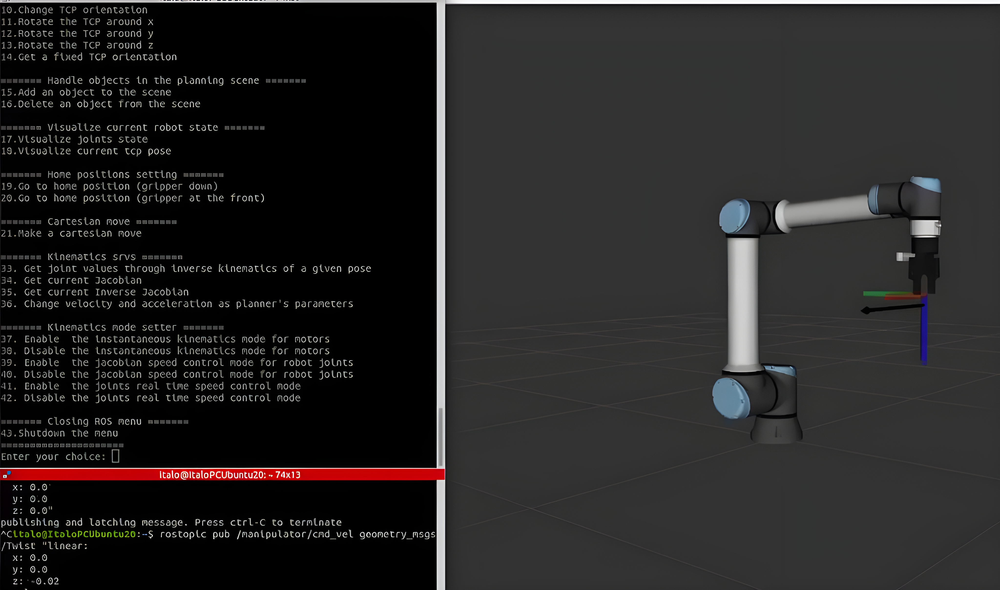
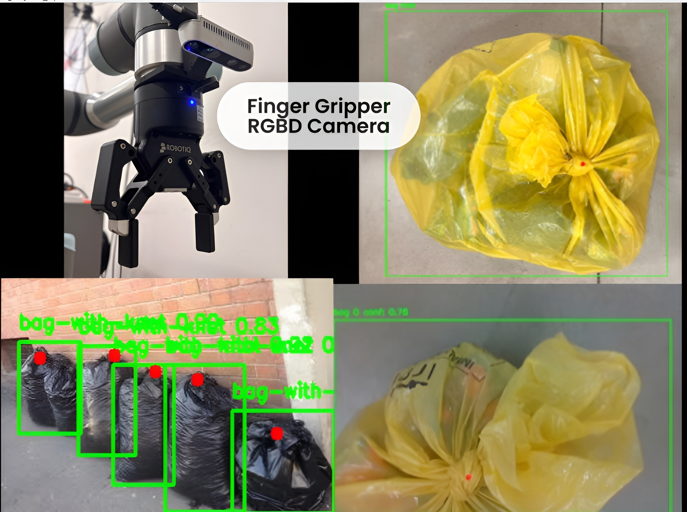
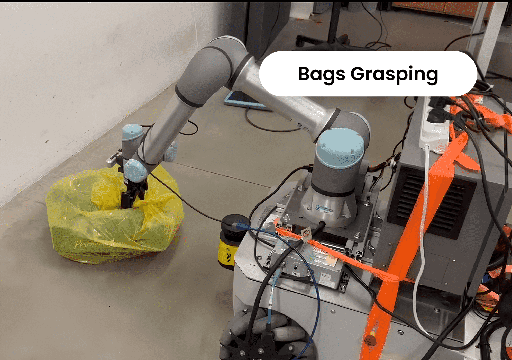
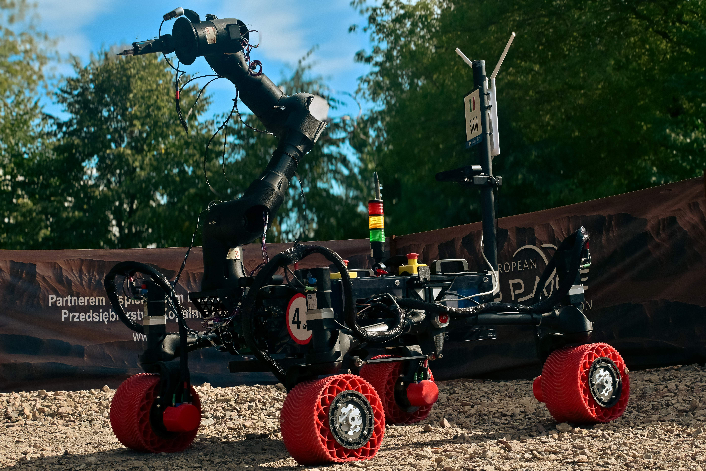
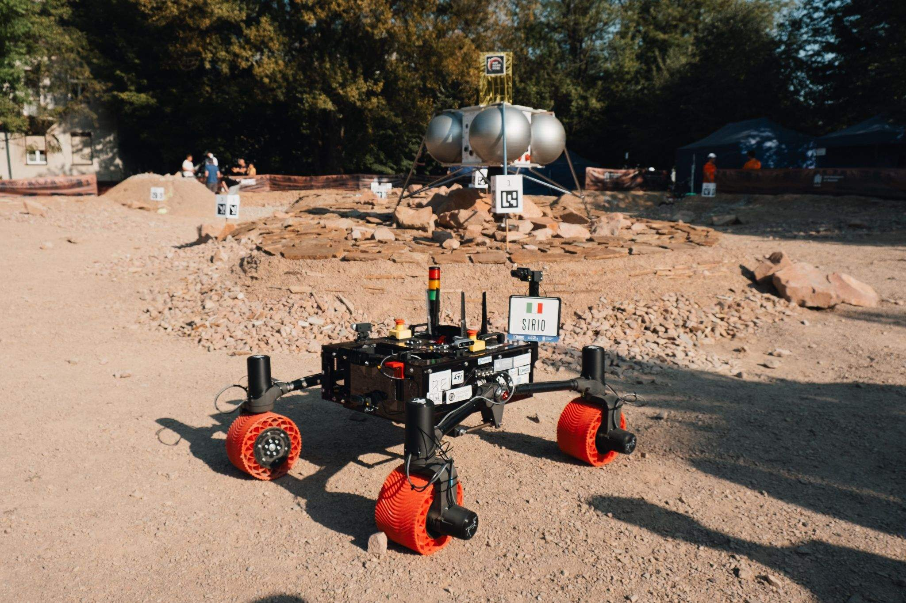
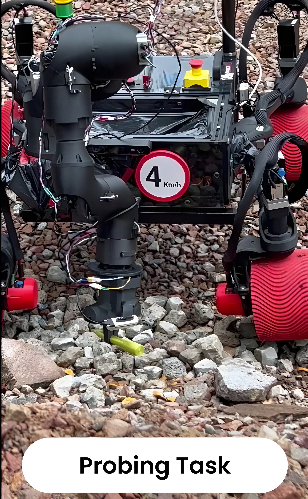
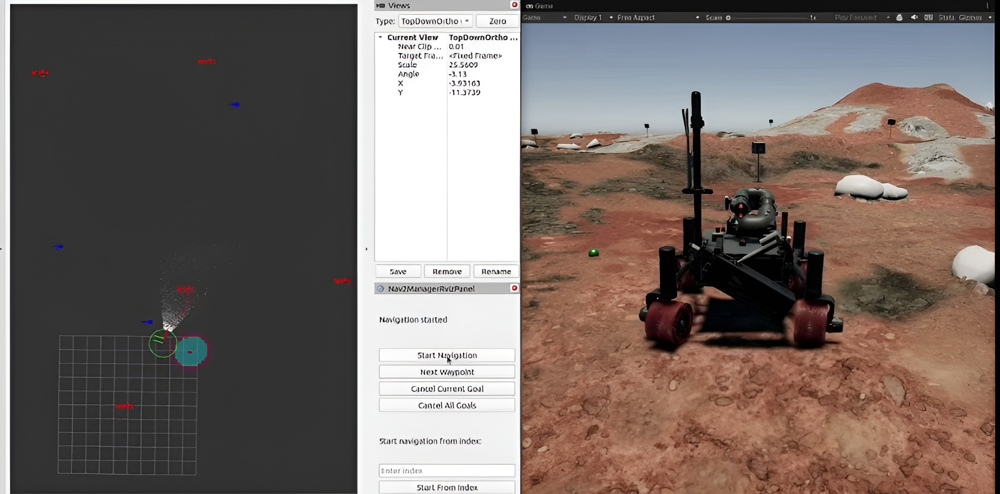
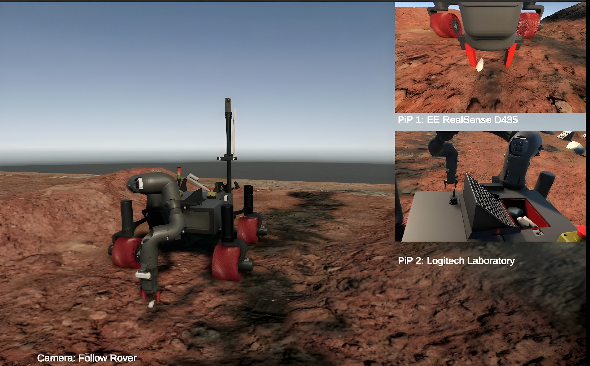

<!-- ## Hi there 👋 -->

<!--
**Italo-99/Italo-99** is a ✨ _special_ ✨ repository because its `README.md` (this file) appears on your GitHub profile.

Here are some ideas to get you started:

- 🔭 I’m currently working on ...
- 🌱 I’m currently learning ...
- 👯 I’m looking to collaborate on ...
- 🤔 I’m looking for help with ...
- 💬 Ask me about ...
- 📫 How to reach me: ...
- 😄 Pronouns: ...
- ⚡ Fun fact: ...
-->

# Italo Almirante – Robotics Portfolio

PhD student in Industrial Innovation Engineering at ARS Control Laboratory (UNIMORE), working on multi-robot systems, autonomous control, and AI-driven robotics.

My work focuses on building scalable and robust robotic systems, spanning the full stack from embedded control to high-level planning and learning.

---

## 🚀 Research Focus

- Multi-robot systems for dynamic warehouse logistics
- Large-scale motion planning (MAPF / TAPF)
- Reinforcement Learning for coordination and optimization
- Robotic soft manipulation with force feedback controls
- 3D perception for environment mapping and obstacle avoidance
- Full-stack robotics systems (embedded → control → AI)

---

## 🤖 Multi-Robot Planning

Development of a scalable warehouse simulation framework integrating ROS2 and CoppeliaSim.

- Supports large fleets (up to 250+ robots)
- Sub-100 ms replanning in dynamic environments
- Event-based and periodic planning strategies
- Robust handling of motion execution errors and dynamic goal updates

  

---

## 🦾 Robotic Manipulation & Perception

Work on manipulation of deformable objects and integration of perception pipelines with control.

- Mobile manipulators (TIAGo, UR)
- Vision-based detection (YOLO, SAM)
- Grasping and task execution in unstructured environments

  
  

  
  

---

## 🚗 Autonomous Rover Systems – ProjectRED

Design and development of autonomous rover platforms for the European Rover Challenge (ERC).

- Autonomous navigation with wheels and visual odometry
- Landmark-based localization using sensor fusion (Kalman filtering)
- Embedded control (STM32, CAN/CANOpen)
- Integration of perception and control systems
- Team leadership and system architecture

  

  
  

  
  

---

## 🧩 Full-Stack Robotics

Experience across the full robotics pipeline:

- Embedded systems: STM32, SPI, I2C, UART
- Communication: CAN, CANOpen
- Control and planning: ROS1/ROS2, MoveIt
- Simulation: CoppeliaSim, Gazebo, MuJoCo, Unity
- AI: PPO, DQN, transformers (tensorflow, pytorch, keras, stable baseline)

---

## 📄 Additional Information

**European Rover Challenge (ERC) participation:**

- **2025** – [Certificate](https://spacecert.org/certificate/25NBF9E2/)
- **2024 (On-Site)** – [Certificate](https://roverchallenge.eu/certificate/projectred-italo-almirante-erc2024-on-site/)
- **2023 (On-Site)** – [Certificate](https://roverchallenge.eu/certificate/2023-onsite-projectred-italo-almirante/)
- **2023 (Remote)** – [Certificate](https://roverchallenge.eu/certificate/2023-remote-projectred-italo-almirante/)

---

## 🔗 Links

- 🌐 [Personal Website](https://italo-99.github.io/)
- 💼 [LinkedIn](https://www.linkedin.com/in/italo-almirante-62431a216)
- 🎓 [Google Scholar](https://scholar.google.com/citations?user=Ap9R8foAAAAJ)

- 🤖 [ProjectRED](https://www.dismi.unimore.it/it/didattica/progetti-gli-studenti/project-red)
- 🧪 [ARS Control Laboratory](https://www.arscontrol.unimore.it/)
- 🏫 [DISMI – University of Modena and Reggio Emilia](https://www.dismi.unimore.it/)

---
